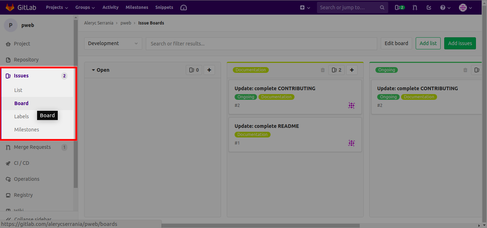
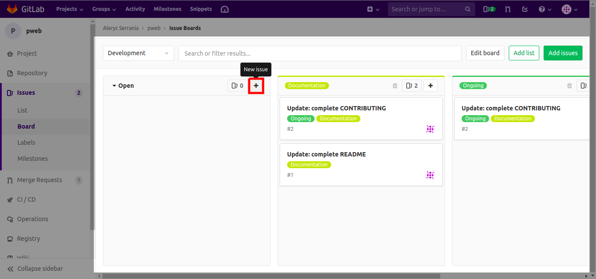
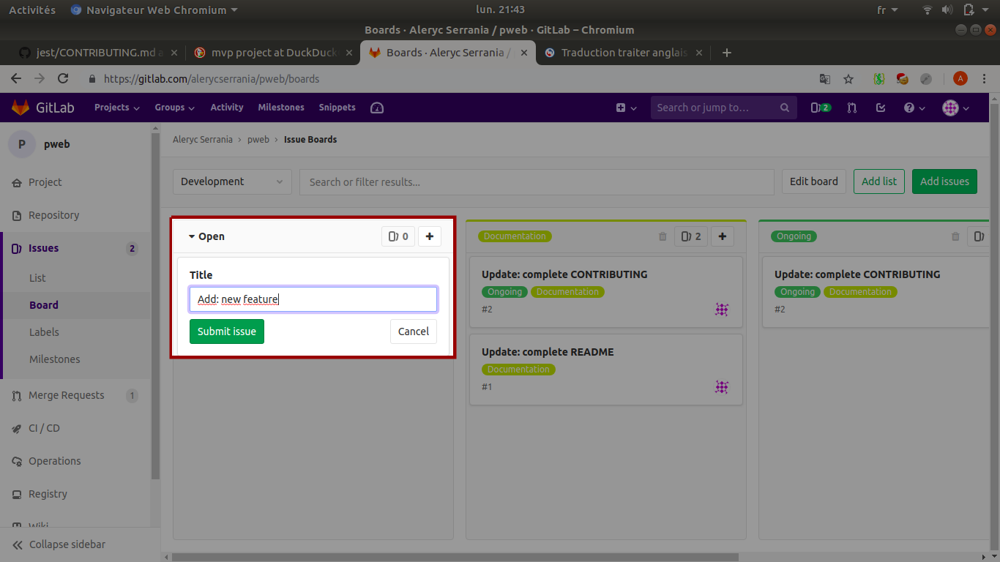
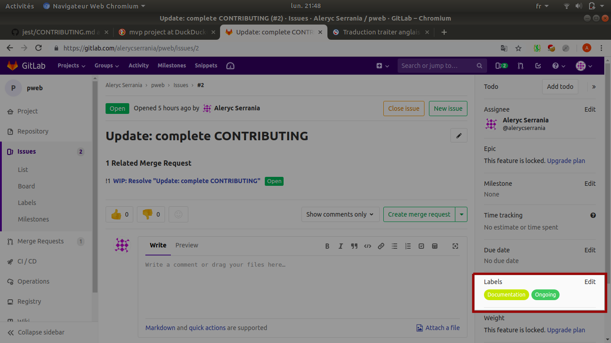
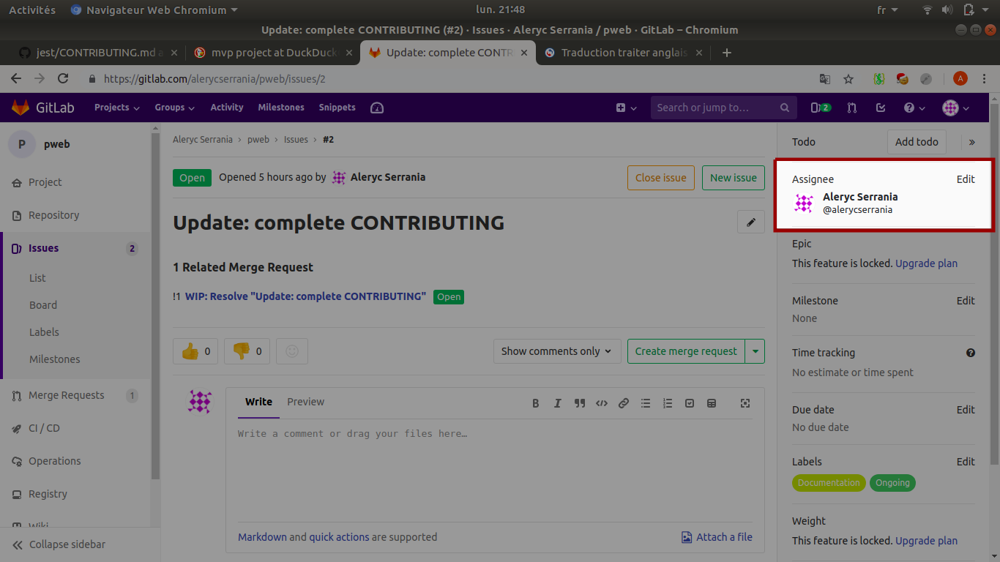
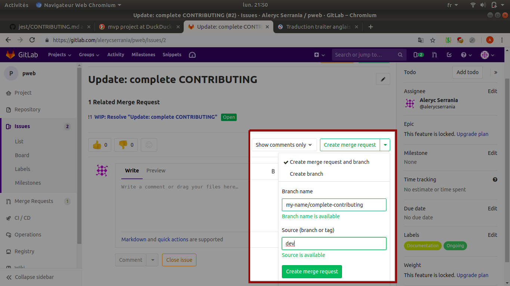

How to contribute
=================

This file is a guide detailing the step to contribute to this amazing project

## Table of contents
- [First step](#first-step)
  - [Clone the repository](#clone-repo)
- [Propose a new task](#propose-task)
  - [Create a new issue](#create-issue)
  - [Edit this issue](#edit-issue)
    - [Add labels](#add-label)
    - [Assign this task to someone](#assign-task)
- [Work on a task](#work-task)
    - [Create a merge request](#create-merge-request)
    - [Pull the repository](#pull-repo)
    - [Commit and push your changes](#push-changes)
- [Warning](#warning)

## <a id="first-step">First step</a>

### <a id="clone-repo">Clone the repository</a>

First, you should **clone** the repository :

```bash
git clone "https://gitlab.com/alerycserrania/pweb.git"
```

And... that's it! Nothing else to do for now!


## <a id="new-feature">Propose a new task</a>

I know you must have a lot of awesome ideas for our project. You just need to follow these step in order to help creating the most incredible website.

### <a id="create-issue">Create a new issue</a>

Go to the **issue board** page. You should see something like this:



Once you're here, click on the `New Issue` button on the `Open` panel



Then, type the **name** of the feature you want to add



**Convention** for the name : 
```bnf
<Type>:  <Short description>
```
`Type` can be `Add`, `Update` or `Fix`

Voilà! You created your first issue for this project. 

### <a id="edit-issue">Edit this issue</a>

Your first issue is not bad, but you should add more details to help others know what it is about

#### <a id="add-labels">Add labels</a>

You can **add a label to categorize** this task. For instance, if this task is about adding documentation in a file you should apply the `documentation` label.



#### <a id="assign-task">Assign this task to someone</a>

Not everyone should work on this task, therefore assigning someone to work on it is important.



## <a id="work-task">Work on a task</a>

Now head to the **issue board** page to view the task you can work on.

### <a id="create-merge-request">Create a merge request</a>

Before doing anything, check on the upper right corner **if anyone has already been assigned** to this task. If there is no one, you can assign it to yourself! 


After that, **choose a name** for the branch and select the `dev` branch as a source.


Convention for branch name :

```bnf
<your-name>/<short-description-of-this-task>
```

Now you should see your merge request on the **merge request page**

Tadaaa~ you did it!

### <a id="pull-repo">Pull the repository</a>

You can start working locally. Go to your workspace and **pull the repository** :

```bash
cd <location-of-local-repository>/
git pull
```

The newly created branch should be added to your local repository. **Switch** the current branch to this branch :

```bash
git checkout <name-of-the-new-branch>
```

### <a id="push-changes">Commit and push your changes</a>

You finally **completed the task** that has taken you enough time to lose all hope of seeing your family again.

Great.

Congratulation! You can **commit** your changes and **push** them to the remote:

```bash
git add .
git commit -m "short description of what you did" -m "add details"
git push origin <name-of-the-branch>
```

## <a id="warning">Warning</a>

**Never push to `dev` or `master` branch. This would have a lot of terrible consequences like :**

  - World being invaded by cute assassin kittens
  - Mickey Mouse coming to your house telling you for 24h that what you did was really mean
  - etc...

